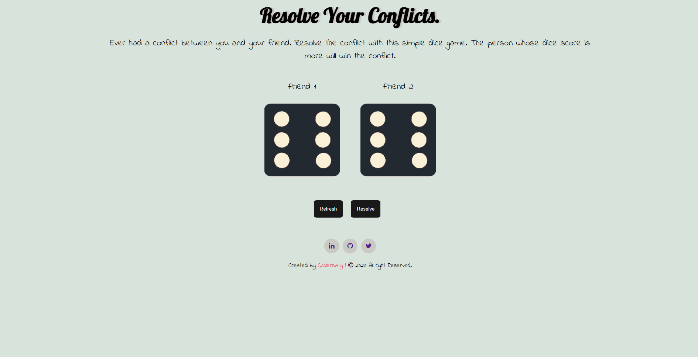

<h1 align="center" id="top">Welcome to Conflict Resolver 👋</h1>

# Basic Overview

> This project is a simple responsive website used to resolve conflict between two people with help of a simple game.

 

# Table of Contents

- [Description](#description)
- [Technologies Used](#technologies)
- [How to use](#How-to-use)
- [References](#references)
- [License](#license)
- [ToDos](#To-Dos)
- [Related Projects](#related-projects)
- [Support](#support)
- [Author Info](#author-info)

 

# Description

A simple and easy to use responsive website created using HTML5, CSS and javascript
to resolve conflice between two different people using a simple game. The simple game is such that the player has to click the resolve button and dice will roll the person who scores more is the winner and his take on the conflict will be taken.

[Live Demo](https://codersaty.github.io/conflictResolver/)

 

# Technologies

- [HTML5](https://en.wikipedia.org/wiki/HTML5)
- [CSS3](https://en.wikipedia.org/wiki/CSS)
- [JavaScript](https://en.wikipedia.org/wiki/JavaScript)
- [Git](https://en.wikipedia.org/wiki/Git)
- [Markdown](https://en.wikipedia.org/wiki/Markdown)

### Tools used

- [VS Code](https://en.wikipedia.org/wiki/Visual_Studio_Code)
- [Github](https://en.wikipedia.org/wiki/GitHub)

 

# How to Use

- Hit the Resolve button the roll the dice.

- The score of both the player will be displayed on the dice.

- The person who has the high score wins the game.

# References

I have used the following resources in creation of this project:

- [The Complete 2021 Web Development Bootcamp](https://www.udemy.com/course/the-complete-web-development-bootcamp/)

 

# License

[MIT License](LICENSE.md)

Copyright (c) 2021 @[codersaty](http://codersaty.me)

 

# To Dos

> Thinking About it.

 

# Related Projects

> I will add the projects soon.

 

# Support

In case of any problem/ query, feel free to do pull requests or contact the author.

 

# Author Info

- Twitter - [@codersaty](https://twitter.com/codersaty)
- Website - [Anuranjan Srivastava](http://codersaty.me)
- Linkedin - [codersaty](https://www.linkedin.com/in/codersaty)

 

[Back To The Top](#top)